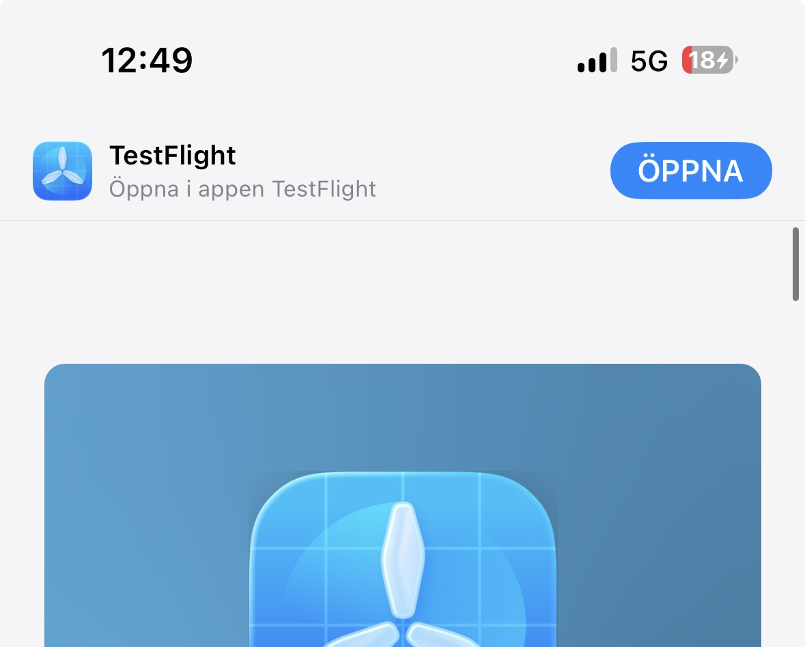
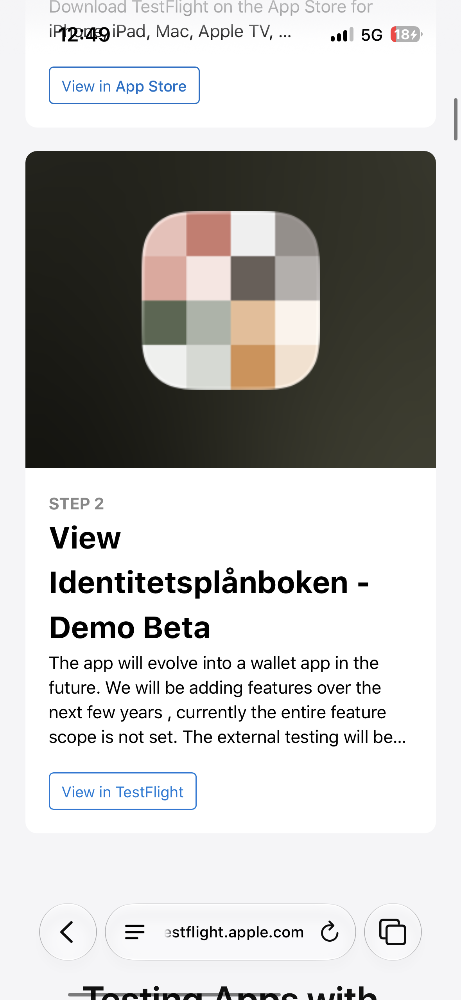

# Prova plånboksappen under utveckling

Denna guide beskriver steg-för-steg hur du laddar ned, installerar och provar den statliga identitetsplånboksappen (hädanefter kallad appen) under utveckling i Diggs Sandbox-miljö.

## Innehåll
1. [Få åtkomst till appen](#1-få-åtkomst-till-appen)
2. [Installera appen](#2-installera-appen)
3. [Första uppstart och hämtning av test-ID](#3-första-uppstart-av-appen-och-hämtning-av-test-id-pid)
4. [Testa att använda din PID](#4-testa-att-använda-din-pid-vaccincentralen)
5. [Återkoppling och Support](#återkoppling-och-support)

---

## Steg-för-steg-guide

### 1. Få åtkomst till appen

För att kunna ladda ned appen under utvecklingsfasen behöver du först bli inbjuden som testare. 

1. Skriv ett e-postmeddelande till [digitalwallet@digg.se](mailto:digitalwallet@digg.se) och meddela att du vill testa appen.
2. I ditt mejl behöver du specificera:
   - **Plattform:** Android eller iOS.
   - **E-postadress:** Den e-postadress som är kopplad till din telefons Google-konto (för Android/Google Play) eller Apple-konto (för iOS/TestFlight).
3. Vänta på att du får en inbjudningslänk skickad till dig.

---

### 2. Installera appen

Beroende på vilken plattform du använder följer du instruktionerna nedan när du har fått din inbjudan.

#### Installera på iOS (Apple)
1. Om du inte redan har appen **TestFlight** installerad på din telefon, ladda ned den från **App Store**.
2. Öppna e-postmeddelandet med din inbjudan och klicka på inbjudningslänken. En sida öppnas nu i webbläsaren (testflight.apple.com).
3. Klicka på **Öppna** i TestFlight-bannern högst upp på sidan:

   

   Alternativt kan du scrolla ned till *Identitetsplånboken - Demo Beta* och klicka på **View in TestFlight** (Visa i TestFlight):

   

4. TestFlight öppnas med din inbjudan. Klicka på **Godkänn** (Accept) och därefter på **Installera** för att hämta plånboksappen.
5. Appen är nu installerad och redo att öppnas!

#### Installera på Android (Google)
1. Öppna e-postmeddelandet med din inbjudan och klicka på inbjudningslänken.
2. Säkerställ att du är inloggad i webbläsaren/Google Play med exakt samma e-postadress som du angav när du ansökte om åtkomst.
3. Klicka på **Accept invite** (Acceptera inbjudan).
4. Klicka på länken *download it on Google Play* för att slussas till Google Play Store och installera appen.
5. Appen är nu installerad och redo att öppnas!

---

### 3. Första uppstart av appen och hämtning av test-ID (PID)

När du öppnar appen första gången behöver du konfigurera den och ladda den med ett test-ID (Personidentitetsdata / PID).

1. **Öppna appen** och klicka på **Nästa** i introvyn.
3. **Skapa en PIN-kod** (välj en kod du vill använda för att logga in i appen framöver) och klicka på **Nästa**.
4. **Bekräfta PIN-koden** genom att ange samma kod igen och klicka på **Nästa**.
5. Nu är det dags att ladda på en PID i plånboken. Klicka på **Begär personuppgifter**.
6. Klicka på **Logga in** för att identifiera dig mot Diggs test-PID-utfärdare.
7. Välj en av de fördefinierade testanvändarna i listan och genomför inloggningen.
8. Ditt hämtade attributsintyg visas på skärmen. Granska uppgifterna och klicka på **Godkänn** längst ner på sidan.
9. Grattis! Du har nu ett test-ID (PID) sparat i din plånbok.

---

### 4. Testa att använda din PID (Vaccincentralen)

För att testa hur plånboksappen kan användas för att logga in eller dela uppgifter med en webbplats har Digg satt upp ett testverktyg kallat **Vaccincentralen**.

Du kan utföra testet på två olika sätt:

#### Alternativ 1: Utför hela flödet på samma mobila enhet
1. Öppna webbläsaren på din mobil (där plånboksappen är installerad) och gå till:  
   [wallet.sandbox.digg.se/demo-verifier/vaccincentralen](https://wallet.sandbox.digg.se/demo-verifier/vaccincentralen)
2. Klicka på **Logga in med din digitala plånbok**.
3. Klicka på **Starta inloggningen**.
4. Klicka på **Har du plånboken på den här enheten?**.
5. Klicka på **Öppna wallet** (på iOS klickar du på *Öppna* i den systemdialog som frågar om du vill öppna appen).
6. Granska de uppgifter som Vaccincentralen efterfrågar (via OpenID4VP-protokollet) i plånboksappen.
7. Klicka på **Skicka**.
8. Du slussas tillbaka till webbläsaren och möts av ett meddelande om att inloggningen lyckades, samt ser de uppgifter som delats med tjänsten!

#### Alternativ 2: Besök tjänsten på en annan enhet (t.ex. PC) och skanna QR-kod
1. Öppna webbläsaren på din dator eller en annan enhet och gå till:  
   [wallet.sandbox.digg.se/demo-verifier/vaccincentralen](https://wallet.sandbox.digg.se/demo-verifier/vaccincentralen)
2. Klicka på **Logga in med din digitala plånbok**.
3. Klicka på **Starta inloggningen**. En QR-kod visas nu på skärmen.
4. Öppna din mobils kamera-app (eller plånboksappens inbyggda skanner) och skanna QR-koden på datorskärmen.
   - *iOS:* Klicka på länken *Öppna i id-plånboken* som dyker upp efter skanningen.
5. Granska uppgifterna som efterfrågas i plånboksappen på din telefon.
6. Klicka på **Skicka**.
7. Webbbläsaren på din dator uppdateras nu automatiskt och visar att inloggningen lyckades tillsammans med den delade datan!
   - *Android:* Plånboksappen visar också en bekräftelse på att sändningen lyckades.

---

## Återkoppling och Support
* Vid frågor, feedback eller tekniska problem, kontakta utvecklingsteamet på [digitalwallet@digg.se](mailto:digitalwallet@digg.se).
